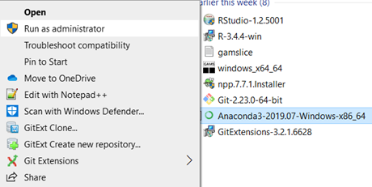
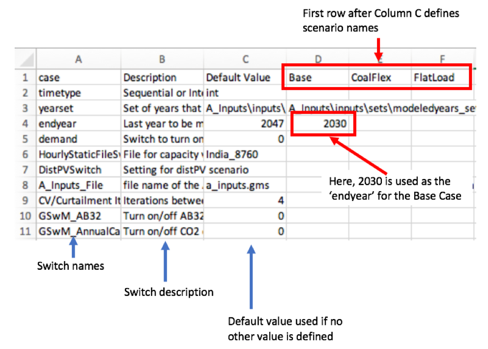

# ReEDS India

## Welcome to the Regional Energy Deployment System (ReEDS) Model!

This GitHub repository contains the source code for NREL&#39;s ReEDS India model. This version was adapted from the ReEDS model developed for North America. [Table 2](#Tab2) summarizes differences in model design and capabilities between the two versions. 

Users of this source code agree to the ReEDS licensing agreement [https://nrel.gov/analysis/reeds/request-access.html](https://nrel.gov/analysis/reeds/request-access.html). The ReEDS India Version 2019 source code is available at no cost from the National Renewable Energy Laboratory. The ReEDS India model can be downloaded or cloned from [https://github.com/NREL/ReEDS\_OpenAccess](https://github.com/NREL/ReEDS_OpenAccess). New users must request access to the ReEDS repository through [https://nrel.gov/analysis/reeds/request-access.html](https://nrel.gov/analysis/reeds/request-access.html).

## Contents

* [Introduction](#Introduction)
* [Required Software](#Software)
* [Setting up your computer to run ReEDS for the first time (for Microsoft Windows 10)](#Setup)
  * [ReEDS India Repository Configuration](#ConfigRepo)
  * [Python Configuration](#ConfigPy)
  * [GAMS Configuration](#ConfigGAMS)
  * [R Configuration](#ConfigR)
* [Guide to the ReEDS India Respository](#RepoGuide)
* [Executing the Model](#Execution)
* [Debugging Tips](#Debug)
* [Documentation](#Documentation)
* [Frequently Asked Questions](#FAQ)
  * [How much are the GAMS licensing fees?](#Fees)
  * [Is there a trial version of the GAMS license so I can test ReEDS?](#Trail)
  * [What computer hardware is necessary to run ReEDS India?](#Hardware)
  * [Can I adjust the model input parameters or constraints?](#Adjust)
* [Contact Us](#Contact)
* [Appendix](#Appendix)
  * [ReEDS India Model Switches](#Switches)
    

# Introduction ([https://www.nrel.gov/analysis/reeds/](https://www.nrel.gov/analysis/reeds/)) 

The Regional Energy Deployment System (ReEDS) India model is a capacity planning and dispatch model for the Indian electricity system.

As NREL&#39;s flagship long-term power sector model, ReEDS has served as the primary analytic tool for many studies ([https://www.nrel.gov/analysis/reeds/publications.html](https://www.nrel.gov/analysis/reeds/publications.html)) of important energy sector research questions, including clean energy policy, renewable grid integration, technology innovation, and forward-looking issues of the generation and transmission infrastructure. The ReEDS India model extends this capability to investigate critical power sector question for India.

ReEDS uses high spatial resolution and high-fidelity modeling. Though it covers a broad geographic and technological scope, ReEDS is designed to reflect the regional attributes of energy production and consumption. Unique among long-term capacity expansion models, ReEDS possesses advanced algorithms and data to represent the cost and value of variable renewable energy; the full suite of other major generation technologies, including fossil and nuclear; and transmission and storage expansion options. Used in combination with other NREL tools, data, and expertise, ReEDS can provide objective and comprehensive electricity system futures.

# Required Software
 
 The ReEDS model is written primarily in GAMS with auxiliary modules written in Python and R. At present, NREL uses the following software versions: GAMS 24.7.4; Python 3.6.5; R 3.4.4;. Other versions of these software may be compatible with ReEDS, but NREL has not tested other versions at this time.

GAMS is a mathematical programming software from the GAMS Development Corporation. &quot;The use of GAMS beyond the limits of the free demo system requires the presence of a valid GAMS license file.&quot; [[1](https://www.gams.com/latest/docs/UG_License.html)] The ReEDS model requires the GAMS Base Module and a linear programming (LP) solver (e.g., CPLEX). The LP solver should be connected to GAMS with either a GAMS/Solver license or a GAMS/Solver-Link license. &quot;A GAMS/Solver connects the GAMS Base module to a particular solver and includes a license for this solver to be used through GAMS. It is not necessary to install additional software. A GAMS/Solver-Link connects the GAMS Base Module to a particular solver, but does not include a license for the solver. It may be necessary to install additional software before the solver can be used.&quot; [[2](https://www.gams.com/products/buy-gams/)]

NREL subscribes to the GAMS/CPLEX license for the LP solver, but open-source and free, internet-based services are also available. The [_COIN-OR Optimization Suite_](https://www.coin-or.org/downloading/) includes open-source solvers that can be linked with GAMS through the GAMS Base Module. NREL has not tested the performance of these open-source solvers for ReEDS. The [_NEOS Server_](https://neos-server.org/neos/) is a free, internet-based service for solving numerical optimization problems. Links with NEOS can be made through [_KESTREL_](https://www.gams.com/latest/docs/S_KESTREL.html) which is included in GAMS Base Module. In its current form, ReEDS cannot be solved using NEOS due to the 16 MB limit on submissions to the server. However, modifications _could_ be made to ReEDS to _potentially_ reduce the data below to the required submission size.

Python is &quot;an object-oriented programming language, comparable to Perl, Ruby, Scheme, or Java.&quot; [[3](https://wiki.python.org/moin/BeginnersGuide/Overview)] &quot; Python is developed under an OSI-approved open source license, making it freely usable and distributable, even for commercial use. Python&#39;s license is administered by the Python Software Foundation.&quot; [[4](https://www.python.org/about/)]. NREL uses Conda to build the python environment necessary for ReEDS. Conda is a &quot;package, dependency and environment management for any language.&quot; [[5](https://docs.conda.io/en/latest/)]

&quot;R is a language and environment for statistical computing and graphics…R is available as Free Software under the terms of the Free Software Foundation&#39;s GNU General Public License in source code form.&quot; [[6](https://www.r-project.org/about.html)]

# Setting up your computer to run ReEDS for the first time (for Microsoft Windows 10)

The setup and execution of the ReEDS model can be accomplished using a command-line interpreter application and launching a command line interface (referred to as a &quot;terminal window&quot; in this document). For example, initiating the Windows Command Prompt application, i.e., cmd.exe, will launch a terminal window ([Figure 1](#Fig1)).

*Figure 1. Screenshot of a Windows Command Prompt terminal window.*

While these installation instructions are specific to Windows 10, this version of ReEDS India has been tested to be compatible with MacOS High Sierra 10.12 as well as Linux CentOX 7.4 operating systems.

**SUGGESTON:** use a command line emulator such as ConEmu ([https://conemu.github.io/](https://conemu.github.io/)) for a more user-friendly terminal. The screenshots of terminal windows shown in this document are taken using ConEmu.

**IMPORTANT:** Users should exercise Administrative Privileges when installing software. For example, right click on the installer executable for one of the required software (e.g., Anaconda3-2019.07-Windows-x86\_64.exe) and click on &quot;Run as administrator&quot; ([Figure 2](#Fig2)). Alternatively, right click on the executable for the command line interface (e.g., Command Prompt) and click on &quot;Run as administrator&quot; ([Figure 3](#Fig3)). Then run the required software installer executables from the command line.

 

*Figure 2. Screenshot of running an installer executable using &quot;Run as administrator&quot;.*

 
*Figure 3. Screenshot of running &quot;Command Prompt&quot; with &quot;Run as administrator&quot;.*

## ReEDS India Repository Configuration

The ReEDS India source code is hosted on GitHub: https://github.com/NREL/ReEDS\_OpenAccess

1. Request access to the ReEDS GitHub repository at [https://nrel.gov/analysis/reeds/request-access.html](https://nrel.gov/analysis/reeds/request-access.html).
3. Clone the ReEDS-2.0 repository on your desktop and use the repository with GitHub Desktop. Alternatively, download a ZIP from GitHub ([Figure 4](#Fig4)).

 
*Figure 4. Screenshot of GitHub links to clone the ReEDS repository or download ZIP of the ReEDS files.*

## Python Configuration

Install Anaconda: [https://www.anaconda.com/distribution/#download-section](https://www.anaconda.com/distribution/#download-section). NREL recommends Python 3.7, but has also used Python 3.6.5 and 3.7.1 successfully.

**IMPORTANT** : Be sure to download the correct version of the installer for your operating system.

Add Python to the &quot;path&quot; environment variable

1. In the Windows start menu, search for &quot;environment variables&#39; and click &quot;Edit the system environment variables&quot; ([Figure 5](#Fig5)). This will open the &quot;System Properties&quot; window ([Figure 6](#Fig6)).
2. Click the &quot;Environment Variables&quot; button on the bottom right of the window ([Figure 6](#Fig6)). This will open the &quot;Environment Variables&quot; window ([Figure 7](#Fig7)).
3. Highlight the Path variable and click &quot;Edit&quot; ([Figure 7](#Fig7)). This will open the &quot;Edit environment variable&quot; window ([Figure 8](#Fig8)).
4. Click &quot;New&quot; ([Figure 8](#Fig8)) and add the directory locations for \Anaconda\ and \Anaconda\Scripts to the environment path.

**IMPORTANT** : Test the Python installation from the command line by typing &quot;python&quot; (no quotes) in the terminal window. The Python program should initiate ([Figure 9](#Fig9)).

Install the gdxpds package from the command line by typing &quot;pip install gdxpds&quot; (no quotes) in the terminal window ([Figure 10](#Fig10)).The gdxpds package is required for reading GAMS Data Exchange files (.gdx) into Python.

 
*Figure 5. Screenshot of a search for &quot;environment variables&quot; in the Windows start menu.*

 

 
*Figure 6. Screenshot of the &quot;System Properties&quot; window.*

 

 
*Figure 7. Edit the Path environment variable.*

*Figure 8. Append the Path environment.*

*Figure 9. Screenshot of a test of Python in the terminal window.*

## GAMS Configuration

Install GAMS: [https://www.gams.com/download-old/](https://www.gams.com/download-old/). NREL uses GAMS version 24.7 but has not tested the compatibility of ReEDS with newer versions of GAMS. A valid GAMS license must be installed. Please refer to the [Required Software](#Software) section above for more information.

Add GAMS to the &quot;path&quot; environment variable. Follow the same instructions as for adding Python to the path in the [Python Configuration](#ConfigPy) section above. Append the environment path with the directory location for the _gams.exe_ application (e.g., C:\GAMS\win64\24.7).

**IMPORTANT** : Test the GAMS installation from the command line by typing &quot;gams&quot; (no quotes) in the terminal window. The GAMS program should initiate (Figure 10).

*Figure 10. Screenshot of a test of GAMS from the terminal window.*

## R Configuration

Install R 3.4.4: [https://cran.r-project.org/bin/windows/base/old/3.4.4/](https://cran.r-project.org/bin/windows/base/old/3.4.4/). NREL has observed compatibility issues with other versions of R. NREL has not tested R versions more recent than 3.4.4. Optionally, install RStudio: [https://www.rstudio.com/products/rstudio/download/#download](https://www.rstudio.com/products/rstudio/download/#download).

Add R to the &quot;path&quot; environment variable. Follow the same instructions as for adding Python to the path in the [Python Configuration](#ConfigPy) section above. Append the environment path with the directory location for the _R.exe_ and _Rscript.exe_ applications (e.g., C:\Program Files\R\R-3.4.4\bin\).

**IMPORTANT** : Test the R installation from the command line by typing &quot;r&quot; (no quotes) in the terminal window. The R program should initiate ([Figure 11](#Fig11)).

*Figure 11. Screenshot of a test of R from the terminal window.*

# Guide to the ReEDS India Respository

The ReEDS India repository is organized into six (6) folders. In the main folder there are two files. “runmodel.py” is a python file with a command line interface to manage all model runs. “cplex.op4” defines the options for the cplex solver. 

[Table 1](#Tab1) summarizes the model files in the ReEDS India repository.

*Table 1. Organization of model files in ReEDS India repository.*

| A_Inputs     | Contains all model inputs and GAMS code to read in inputs and format them for model execution |
| :-------------|:----------------------------------------------------|
| <ul><li>*a_inputs.gms*</li><ul> | read in and format all model inputs |
| <ul><li>*cases.csv*</li><ul> | define all model scenarios |
| <ul><li>*inputs* folder</li><ul> | series of csv files organized in subfolders containing all model inputs |
| **B_Equations**  | **Declares model variables, constraints, and objective function** |
| <ul><li>*b1_model_constraints.gms*</li><ul> | define all variables and constraints |
| <ul><li>*b2_objective_function.gms*</li><ul> | define the objective function, broken into two parts (investment costs and operating costs) |
| **C_Solve**      | **Initiates all solve parameters and solve the model**|
| <ul><li>*c1_Solveprep.gms*</li><ul> | initiate the LP solve and compute parameters based on switch values and configurations defined in “cases.csv” |
| <ul><li>*c2_Solve_Int.gms*</li><ul> | execute the model using the intertemporal solve option |
| <ul><li>*c3_augur_data_dump.gms*</li><ul> | create a gdx file with all of the data necessary for the Augur module to solve |
| **D_Augur**       | **Computes capacity credit and curtailment using hourly load and generation data** |
| <ul><li>*d00_pickle_prep.py*</li><ul> | create pickle files for hourly load and resource data |
| <ul><li>*d0_ReEDS_augur.py*</li><ul> | call the below scripts in order and write results to a gdx file that is read back into ReEDS |
| <ul><li>*d1_prep_data.py*</li><ul> | prepare data for Osprey and package it into a single gdx file |
| <ul><li>*d2_osprey.gms*</li><ul> | optimize generation, transmission, and storage with hourly time resolution |
| <ul><li>*d3_gdx_dump.gms*</li><ul> | output raw data from Osprey as .csv files |
| <ul><li>*d4_process_osprey_results.py*</li><ul> | standardize generator results and aggregate transmission flows to region level  |
| <ul><li>*d5_existing_curtailment.gms*</li><ul> | compute the curtailment of existing resources based on results from Osprey |
| <ul><li>*d6_marginal_curtailment.gms*</li><ul> | compute the curtailment of marginal variable generation based on results from Osprey |
| <ul><li>*d7_condor.R*</li><ul> | calculate the energy arbitrage revenue for marginal storage additions |
| <ul><li>*d8_capacity_credit.R*</li><ul> | calculate capacity credit of existing and marginal variable generation |
| **E_Outputs**    | **Generates gdx files with model results** |
| <ul><li>*e1_create_report.gms*</li><ul> | format results and write them to gdx file |
| <ul><li>*e2_process_outputs.py*</li><ul> | process ReEDS model results from gams and save key results in Excel format |
| <ul><li>*runs* folder</li><ul> | solution folders for each model scenario saved with the name “{runname}_{scenarioname}” |
| **F_Analysis**   | **Create html and figures of model outputs** |
| <ul><li>*ReEDS-India-markdown.Rmd*</li><ul> | generate html of model results for all user-defined scenarios |
| <ul><li>*data* folder</li><ul> | external data used for generating plots and tables (i.e., geographic coordinates for mapping) |
| <ul><li>*scripts* folder</li><ul> | R scripts used to query gdx solution file and generate plots and tables |
| <ul><li>*valuestreams* folder</li><ul> | calculate and store shadow price of each model constraint to identify sources of value for each investment decision |

# Executing the Model

The execution of the ReEDS India model can be accomplished by using a command-line interpreter application and launching a command line interface.

A ReEDS India scenario (also referred to as a &quot;run&quot;, &quot;case&quot; or &quot;instance&quot;) is executed through a python-based case batching program called &quot;runmodel.py&quot;. The user can execute a single case or a batch of cases using this program.

**Step 1** : Specify the ReEDS scenario name(s) and configuration(s) in the case configuration file.([Figure 12](#Fig12)). 

The scenario configuration file name is called &quot;cases.csv&quot; in the &quot;A_Inputs&quot; folder. Within &quot;cases.csv&quot;, the data in Column A are the model &quot;switches&quot; (also referred to as &quot;options&quot;). Column B provides brief descriptions of the switches. The data in Column C are the default values of the switches. Every subsequent column represents an individual model scenario, beginning with Column D. The scenario name is specified in Row 1. The value for each switch is specified beginning in Row 2. If a switch value is left blank, the default value from Column C is used. Users can tailor the default scenarios in two ways: 1.) adjust the default switch values for an existing scenario or 2.) create a new scenario by adding a new column with a scenario name in Row 1 and desired switch values beginning in Row 2.

A complete list of switches is provided in the Appendix of this document.

 

*Figure 12. Screenshot of cases.csv.*

**Step 2** : Compile and run the model from the command line

1. Initiate a command-line interpreter application and launch a command line interface.
2.	Navigate to the ReEDS India model directory in the command line.
3.	Enter 
	> python runmodel.py

in the command line and press &quot;Enter/Return&quot; to initiate the ReEDS India model

4.	You will then be asked to name the model run. Enter a name using valid characters and press return: 

	> Specify the name of the run(s)
	
	> Run Name (default is a timestamp): testrun

5.	Next, you will be asked which scenario you would like to run. This list is generated from the column headers in &quot;cases.csv&quot;. By default, the following options are available. 
Please select which scenarios you would like to run
Enter each selected number separated by a comma (i.e. 1, 3)

> -----------------------------------------------------------

> 0 -- Base

> 1 -- CoalFlex

> 2 -- FlatLoad

> 3 -- LowLoad

> 4 -- LowSolarCost

> 5 -- NewGas

> 6 –- LowBatCost

> 7 -- toy

> 8 -- RUN ALL

> Selected scenarios (default 8): 0,4,6

6.	Next, you will be asked if you want to use capacity credit and curtailment capabilities in ReEDS. These modules use the investment and generation outputs from ReEDS and calculate capacity credit and curtailment for variable generation and storage technologies. The results are fed back into the ReEDS model to adjust the variable decisions. The number of iterations between the ReEDS optimization problem and capacity credit and curtailment calculations is defined in &quot;cases.csv&quot;. 

> Do you want to iteratively calculate capacity value and curtailment? (0=no / 1=yes, default 1): 0

7.	Select whether you wish to compile a model, which will execute scripts contained in the 'A_Inputs' and 'B_Equations' modules of ReEDS. This option should almost always be selected, unless you are attempting to run a previously compiled model. 

> Compile inputs and model equations? (0=no / 1=yes, default 1): 1

8.	Select whether you want to run the model, which will execute scripts contained in the 'C_Solve', 'D_8760' and 'E_Outputs' modules of ReEDS. Only select this option if you are on the computer which you wish to run ReEDS on. By default, this will run the selected scenarios in cases.csv sequentially. If you wish to model scenarios in parallel and have available computational resources (such as a High Performance Computing system), you might be better off selecting '0' at this point, as you should then be asked if you want to create batch files capable of simultaneously running multiple cases. 

> Run model? (0=no / 1=yes, default 1): 1

9.	Finally, choose to compile an R Markdown html file after model completion, with sophisticated visualizations comparing your model results across several temporal and geospatial plots. This requires a proper installation of R available in the system path, along with the 'pacman' R package installed.

> Generate R Markdown for visualization after scenario run? (0=no / 1=yes, default 1): 1

10.	Once all responses are received, the batching program will execute the scenario(s) specified. Each scenario selected to run now has a folder in &quotE_Outputs/runs/&quot; containing two .bat files:
	* &quot;compile_{runname}_{scenarioname}.bat&quot;
	* &quot;run_{runname}_{scenarioname}.bat&quot;

Either of these files can be manually executed in order to compile or run specific modules of ReEDS from outside the command line interface prompt. Either step can be executed by double clicking on the appropriate .bat file in &quot;E_Outputs/runs/&quot;. 
> E_Outputs/runs/testrun_Base/compile_testrun_Base.bat

compile the model (evaluate A_Inputs and B_Equations)

> E_Outputs/runs/testrun_Base/run_testrun_Base.bat

solve the model, requires that a model has already been compiled

**Step 3** : Wait for each case to finish, check for successful completion, and view outputs. 
Following a successful run, a .gdx file with all model results will be stored in &quot;E_Outputs/gdxfiles/output_{runname}_{scenarioname}.gdx&quot;. If R is correctly installed, a standard .html visualization report will automatically open and is also stored in &quot;F_Analysis&quot;

# Debugging Tips

GAMS will produced files unique to each case that can help the user with error debugging:
1. **GAMS Log File**
  * Path: &quot;E_Outputs\runs\{runname}_{scenarioname}\gamslog.txt&quot;
  * Purpose: contains the log outputs for all execution statements from the case batch file
  * **SUGGESTION** : This is a good place to check in which execution step errors may have occurred.
2. **GAMS listing files (\*.lst)**
  * Path: &quot;E_Outputs\\runs\{runname}_{scenarioname}\lstfiles\ &quot;
  * Purpose: contains the listing files for GAMS executions
  * **SUGGESTION** : This is a good place to check in which line of the source code errors may have occurred
3. **GAMS workfile (\*.g00)**
  * Path: &quot;E_Outputs\runs{runname}_{scenarioname}\g00files\ &quot;
  * Purpose: stores a snapshot all the model information available to GAMS at that point in the case execution.
  * For more information about GAMS work files: [https://www.gams.com/latest/docs/UG\_SaveRestart.html](https://www.gams.com/latest/docs/UG_SaveRestart.html)
  * **SUGGESTION** : A failed case can be restarted from this snapshot point. The user can rerun the batch file for the case (E_Outputs\runs\{runname}_{scenarioname}\run_{runname}_{scenarioname}.bat) after commenting out a execution statements that completed successfully.

# Documentation

This model is based on the ReEDS Version 2018 created for the United States. All input parameters have been updated to reflect the India context including electricity demand, technology cost and performance, data on existing and planned infrastructure, resource data, and operating and policy constraints. The ReEDS Version 2018 Documentation on which the ReEDS India model is based is available at no cost from the National Renewable Energy Laboratory: [https://www.nrel.gov/docs/fy19osti/72023.pdf](https://www.nrel.gov/docs/fy19osti/72023.pdf)

[Table 2](#Tab2) summarizes difference between model design and capabilities in US ReEDS Version 2019 and ReEDS India.

*Table 2. Differences between US ReEDS Version 2019 and ReEDS India.*

| Model Features | US Version 2019| ReEDS India |
| --- | --- | --- |
| Geographic resolution and hierarchy | 3 interconnections, 18 RTOs, 19 NERC subregions, 9 census divisions, 134 Balancing Areas, 356 resource regions | 5 interconnected regions, 34 Balancing Areas, 146 resource regions |
| Time slices | 17 time slices: 4 seasons each with 4 representative times per day (overnight, morning, afternoon, evening) and 1 summer &quot;superpeak&quot; | 35 time slices: 5 seasons each with 7 representative times per day (night, sunrise, morning, afternoon, sunset, evening, peak) |
| Gas fuel costs and constraints | Gas supply curve | Gas fuel price is fixed; Annual limits on total available gas fuel for electricity generation |
| Geothermal and CSP | Included | Not included |
| Cooling technologies | Included | Not included |
| Water use accounting | Included | Not included |
| Load from EVs | Included | Not included |
| Clean energy policies | Policies for generation, capacity, emissions, and tax incentives  | National and state capacity targets for wind and solar |
| Operating reserves | Spinning, Regulation, and Flexibility reserve requirements defined for each BA | Spinning reserve requirement for entire country |
| Planning reserve margin | Planning reserve margin set at NERC reference levels for all years, except ERCOT in 2018 and 2019 is set to actual values because the actuals were lower than the NERC reference levels | Seasonal planning reserve margin requirement of 15% peak demand defined for each interconnected region  |
| Technology performance bins | Units binned according to costs and heat rates | Units binned according to reported variable costs which internalize variations in fuel cost and heat rates |
| Absolute growth constraint | Not included | Absolute growth constraint applied for biomass and hydropower technologies |
| Technology Phase Out | Not included | Forced phase out of select technologies including diesel and subcritical coal |
| RE diversity constraint | Not included | Mandate that no more than 15% of new wind and solar additions can be located in any one resource region  |
| Coal cost adder | Not included | State wise variable cost adder for coal based on rail transport charges |

# Frequently Asked Questions

## How much are the GAMS licensing fees?

The GAMS licensing price list is available on the GAMS website ([https://www.gams.com/products/buy-gams/](https://www.gams.com/products/buy-gams/)). Prices listed are &quot;for an unrestricted, perpetual, single named user on a specific platform.&quot; The prices for additional users are a function of the single user price. [Table 3](#Tab3) and [Table 4](#Tab4) below are examples of the pricing for a multi-user licenses for the Base Module and GAMS\CPLEX . **The prices listed in the table are not offical quotes. Please contact GAMS for an offical quote.**

*Table 3. Example of initial GAMS licensing fees (USD) based on the number of users for a **Standard** License on a single platform (e.g., Windows).*

| Number of Users | GAMS Base Module | GAMS\CPLEX | Total |
| --- | --- | --- | --- |
| 1 | 3,200 |  9,600 |  12,800 |
| 5 | 6,400 |  19,200 |  25,600 |
| 10 | 9,600 |  28,800 |  38,400 |
| 20 | 12,800 |  38,400 |  51,200 |
| 30 |  16,000 |  48,000 |  64,000 |

*Table 4. Example of initial GAMS licensing fee example (USD) based on the number of users for an **Academic** License on a single platform (e.g., Windows).*

| Number of Users | GAMS Base Module | GAMS\CPLEX | Total |
| --- | --- | --- | --- |
| 1 |  640 |  1,280 |  1,920 |
| 5 |  1,280 |  2,560 |  3,840 |
| 10 |  1,920 |  3,840 |  5,760 |
| 20 |  2,560 |  5,120 |  7,680 |
| 30 |  3,200 |  6,400 |  9,600 |

## Is there a trial version of the GAMS license so that I can test ReEDS?

You _may_ be able to request a temporary evaluation licenses of the GAMS base module and a GAMS\Solver license. Please contact GAMS for more information.

## What computer hardware is necessary to run ReEDS?

NREL uses Windows servers to execute the ReEDS model. These servers have Intel(R) Xeon(R) CPUs at 2-2.4GHz and 10-14 cores with 160-320GB of RAM. These servers can execute multiple ReEDS cases in parallel.

[Table 5](#Tab5) summarizes RAM usage and total clock time necessary to execute the default ReEDS configuration for the three different solve structures (sequential, window, and intertemporal) using one of these servers.

*Table 5. Ballpark RAM usage and clock time for select model configurations executed on NREL servers.*

| Solve Structure | Solve Steps | Approximate LP size   per instance (after presolve) | Threads | RAM(GB per instance) | Total Clock Time (minutes) |
| --- | --- | --- | --- | --- | --- |
| Intertemporal | 10 sample years 2017-2047 | Rows:1,832k   Columns: 837k   Non-Zeros: 7,637k | 8 | 5GB+ | 40-60|

## Can I adjust the model input parameters or constraints?

You may update some of the model inputs or constraints to reflect your own data or research questions. Some updates may be simple (e.g., change the values in one input csv to test different technology costs) while others may require advanced knowledge of GAMS (e.g., adding a new constraint). 

# Contact Us:

If you have comments and/or questions, please contacts the ReEDS team:

[ReEDS.Inquiries@nrel.gov](mailto:ReEDS.Inquiries@nrel.gov)

# Appendix

## ReEDS India Model Switches
| Switch | Input Type | Description | Defaut Value |
| --- | --- | --- | --- | 
| **Model horizon**  |
| <ul><li>*timetype*</li><ul> | string | Define how the model portrays foresight. This version only includes the intertemporal setting (int) that assumes full foresight of all modeled years | int |
| <ul><li>*yearset*</li><ul> | string | File pointer to specify the years to model | A_Inputs\inputs\sets\modeledyears_set_all.csv |
| <ul><li>*endyear*</li><ul> | integer | Last year to be modeled | 2047 |
| **Scenario inputs** |
| <ul><li>*FuelLimit_file*</li><ul> | string | File pointer for the gas fuel limit inputs | fuel_limit.csv |
| <ul><li>*TechCost_file*</li><ul> | string | File pointer for the technology cost inputs (units: INR/MW) | tech_costs_atb22.csv |
| <ul><li>*MinLoad_file*</li><ul> | string | File name of the min loading limit inputs | minloadfrac0.csv |
| <ul><li>*Hours_file*</li><ul> | string | File name of the hours in each time block | hours.csv |
| <ul><li>*Load_file*</li><ul> | string | File name of the load in each time block | load.csv |
| <ul><li>*PeakDemRegion_file*</li><ul> | string | File name of the peak demand by region | peakdem_region.csv |
| **Generator class definitions** |
| <ul><li>*numclass*</li><ul> | integer | Maximum number of technology classes | 4 |
| <ul><li>*numhintage*</li><ul> | integer | Number of technology bins to create when grouping units with similar performance characteristics | 7 |
| **Capacity Credit and Curtailment** |
| <ul><li>*HourlyStaticFile*</li><ul> | string | File pointer for hourly data used for capacity credit calculations  | India_8760 |
| <ul><li>*CC/Curtailment Iterations*</li><ul> | integer | Number of iterations between ReEDS LP and CC/Curtailment modules | 4 |
| <ul><li>*GSw_CCcurtAvg*</li><ul> | integer | Select method for average CC/curt calculations | 2 |
| **Capacity growth** |
| <ul><li>*retireyear*</li><ul> | integer | First year when economic capacity retirements are allowed | 2023 |
| <ul><li>*REdiversity*</li><ul> | scalar | Maximum fraction of new VRE investments that can go in any one  | 0.15 |
| <ul><li>*GSw_GrowthRel*</li><ul> | binary | Turn relative growth constraint on [1] or off [0] | 1 |
| <ul><li>*GSw_GrowthAbs*</li><ul> | binary | Turn absoluate growth constraint on [1] or off [0] | 1 |
| <ul><li>*GSw_Refurb*</li><ul> | binary | Turn refurbishments on [1] or off [0] | 1 |
| <ul><li>*GSw_Storage*</li><ul> | binary | Turn all storage on [1] or off [0] | 1 |
| <ul><li>*GSw_CurtStorage*</li><ul> | scalar | Fraction of storage that counts toward reducing curtailment | 1 |
| <ul><li>*GSw_Prescribed*</li><ul> | binary | Turn prescribed capacity additions on [1] or off [0] | 1 |
| <ul><li>*GSw_Retire*</li><ul> | binary | Turn endogenous retirements on [1] or off [0] | 1 |
| <ul><li>*GSw_REdiveresity*</li><ul> | binary | Turn geographic diversity constraint for RE additions on [1] or off [0] | 1 |
| **Reserves** |
| <ul><li>*GSw_OpRes*</li><ul> | binary | Turn operating reserve constraints on [1] or off [0] | 1 |
| <ul><li>*GSw_OpResTrade*</li><ul> | binary | Tun operating reserve trading between regions on [1] or off [0] | 0 |
| <ul><li>*GSw_PRM*</li><ul> | binary | Turn planning reserve margin on [1] or off [0] | 1 |
| <ul><li>*GSw_PRMTrade*</li><ul> | binary | Turn planning reserve margin trading between regions on [1] or off [0] | 1 |
| **System operations** |
| <ul><li>*GSw_FuelSupply*</li><ul> | binary | Turn fuel supply constraints on [1] or off [0] | 1 |
| <ul><li>*GSw_MinGen*</li><ul> | binary | Turn min loading constraint on [1] or off [0] | 1 |
| **Policy** |
| <ul><li>*GSw_RECapMandate*</li><ul> | binary | Turn RE capacity targets on [1] or off [0] | 0 |
| <ul><li>*GSw_REGenMandate*</li><ul> | binary | Turn RE generation target on [1] or off [0] | 0 |
| <ul><li>*GSw_TechPhaseOut*</li><ul> | binary | Turn forced phase out of select technologies on [1] or off [0] | 1 |
| <ul><li>*GSw_CarbonTax*</li><ul> | binary | Turn CO2 tax on [1] or off [0] | 0 |
| <ul><li>*GSw_CO2Limit*</li><ul> | binary | Turn national CO2 emissions limit on [1] or off [0] | 0 |
| <ul><li>*carbonpolicystartyear*</li><ul> | integer | First year with carbon policy | 2030 |
| **Linear Program** |
| <ul><li>*GSw_ValStr*</li><ul> | binary | Turn value streams on [1] or off [0] | 0 |
| <ul><li>*GSw_Loadpoint*</li><ul> | binary | Use [1] or disable [0] a loadpoint for the intertemporal solve after the first iteration | 1 |
| <ul><li>*GSw_gopt*</li><ul> | integer | Select solver option file to be used | 4 |

