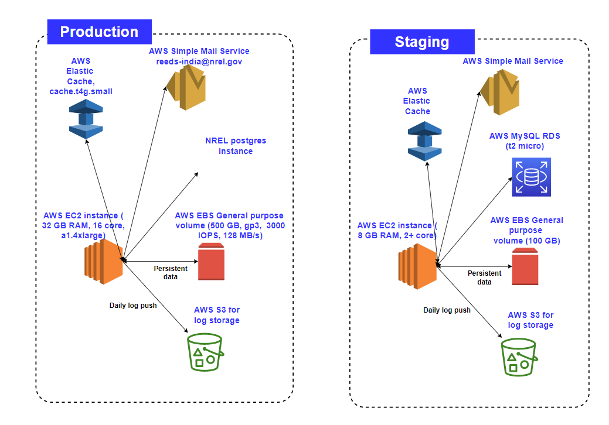

AWS Resource Diagram for Production

#### :rocket: Sandbox environment cost estimate 
---
All cost estimates are for US East (Ohio) region. Not included are network costs, load balancer cost, elastic IPs.

| AWS resource | Unit cost | Estimated cost per month |
|--------------|-----------|--------------------------|
| EC2 Instance   (a1.large, 4 GB RAM, 2 core) | $0.051/hr | $36.72 |
| EBS volumne   (gp3, 50 GB, 3000 IOPS, 128 MB/s)| $0.08/GB-month| $4 |
| Elastic Cache   (cache.t4g.micro, 0.5 GB, 2 vCPU) | $0.016/hr | $11.52 |
| S3 bucket    (S3 standard)| 0.023/GB for storage   $0.005 per 1000 reqs| $5|
| AWS  Simple Mail Service | above 62k $0.1 for  each 1000 emails | $0|
| AWS MySQL RDS Instance   (db.t4g.micro, 2 vCPU, 1 GB) | $0.016 | $11.52|
|Total | | $68.76 |

#### :rocket: Production environment cost estimate 
---
All cost estimates are for US East (Ohio) region. Not included are network costs, load balancer cost, elastic IPs.

| AWS resource | Unit cost | Estimated cost per month |
|--------------|-----------|--------------------------|
| EC2 Instance   (a1.4xlarge, 32 GB RAM, 16 core) | $0.408/hr | $293.76 |
| EBS volumne   (gp3, 500 GB, 3000 IOPS, 128 MB/s)| $0.08/GB-month| $40 |
| Elastic Cache   (cache.t4g.small, 1.37 GB, 2 vCPU) | $0.032/hr | $23.04 |
| S3 bucket    (S3 standard)| 0.023/GB for storage   $0.005 per 1000 reqs| $5|
| AWS  Simple Mail Service | above 62k $0.1 for  each 1000 emails | $0|
| NREL postgres instance | | $0 |
|Total | | $361.8 |